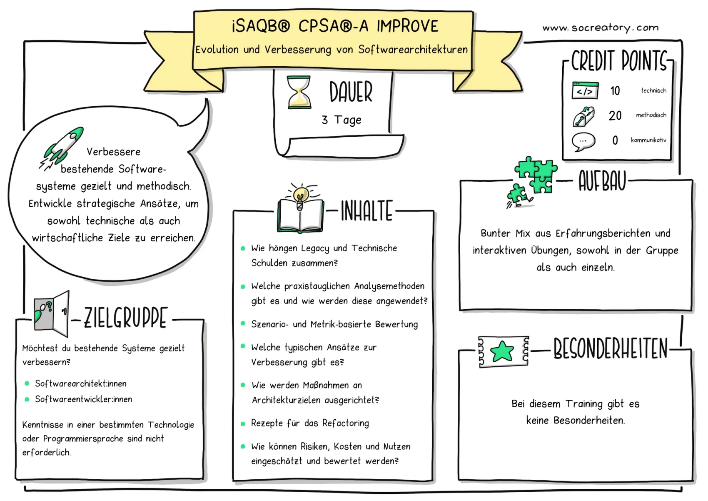
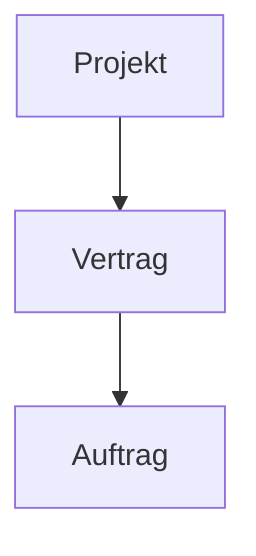
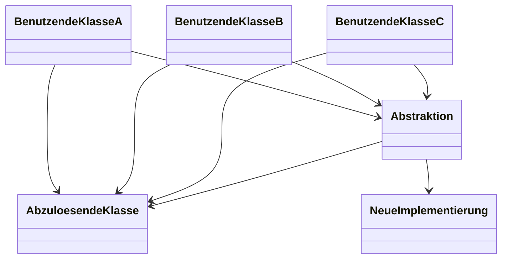

# Tag 1 isaqb-A Improve Schulung 
https://www.socreatory.com/de/trainings/improve

[Slides](.sources/iSAQB-A-IMPROVE-slides.pdf)

## Mender vs Maker
  - unterschiedliche Vorlieben
  - abhängig von Projektphase unterschiedlicher Bedarf

## [aim42](https://www.aim42.org/)  
  - analysieren
  - bewerten
  - verbessern

## Orientierung
> Wer Probleme nur im Code sucht, wir sie auch nur dort finden.

> Nicht nur dort suchen, wo das Licht hinfällt.

> Es ergibt keinen Sinn,  über die Lösung zu sprechen,  bevor wir uns über das Problem einig sind

> Es ergibt keinen Sinn, über die Umsetzungsschritte zu sprechen, bevor wir uns über die Lösung einig sind.

> - Ziel + auf dem Weg => kein Problem
> - Ziel + nicht auf dem Weg => Problem
> - kein Ziel => keine Möglichkeit festzustellen ob man auf dem Weg ist 

Längere Diskussion hierzu, da
- Analyseparalyse vermieden werden sollte
- sich Ziele bei software dynamisch entwickeln

# Analyse
## Kontextabgrenzung
- Ein Kontextdiagramm gibt Überblick, wo das System aktuell eingebettet ist
- Hilft bei späteren Analysen
## Probleme sammeln

## Übung 1 FiVE
### Architecture Comunication Canvas

## Nachmittags
### Klärung der Fachlichkeit
# Analyse
## Pattern Language

[codeanalysen](https://www.kurzelinks.de/codeanalysen)
- Code as a crime scene
- CodeCharta http://codecharta.com/visualization/app/index.html
- Code Scene https://codescene.io/projects/1553/jobs/7546/results

# Tag 3 
## Umsetzung
### Taktiken und Strategien
#### Abhängigkeiten bändigen
- Sensing: an testbare, interne Werte kommen
- Separation: den Code-Teil unabhängig testen
- Seams
- Method Pattern
- Sprouting - Blase mit neuen Patterns und Anti-Corruption-Layer zu altem Code

## Big Bang vs Inkrementell
## Zerlegungsmöglichkeiten
- Sprachliche Abgrenzung ("Produkt" für Lagerist, Marketing, Einkauf)
- Unterschiedliche Zeithorizonte für Änderungen
- Unidirektionale Prozessabläufe
- UI basiertes Reverse-Engineering

- Stranger Fig
- Abspaltung über Abstraktion 

- UI basiertes Reverse-Engineering
- Parallele Änderung
- Parallelbetrieb
